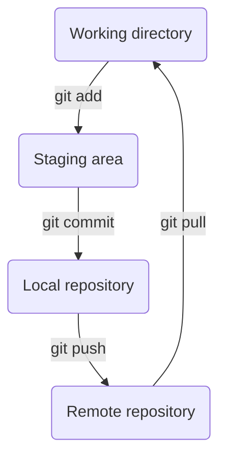
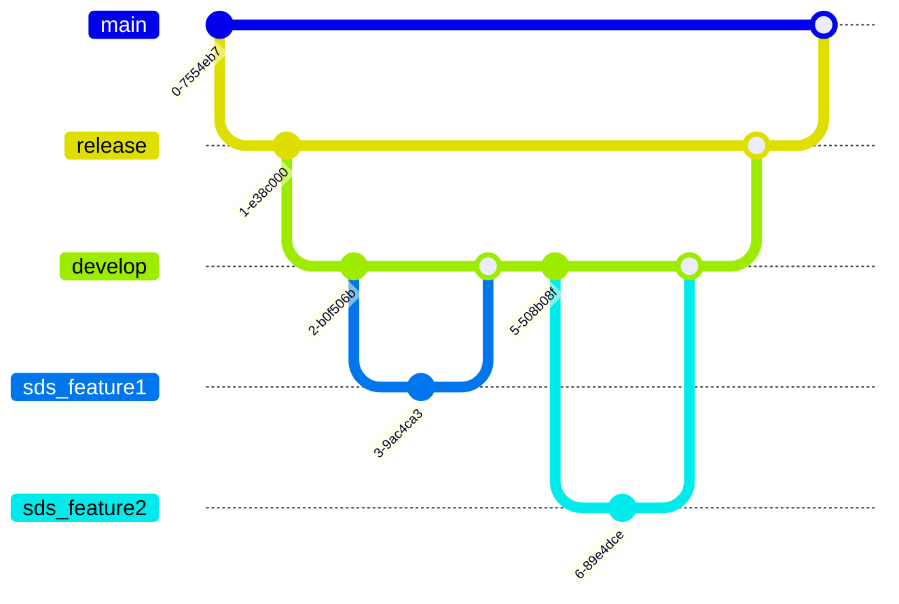

# SDS Tech-X - Les fondamentaux de GIT
<br/>

## Sommaire
1. [Principe de fonctionnement](#principe)
2. [Espaces de travail et commandes de base](#espace)
3. [Système de branches](#branches)
4. [Gestion des erreurs](#gestion-erreur)
5. [Liens utiles](#liens)

<br/>

## Principe de fonctionnement
***
<br/>

Système de contrôle de version open source permettant:
* De suivre l'historique et les évolutions d'un projet
* D'optimiser le travail en équipe


<br> 

GIT traque tous les fichiers d'un projet et enregistre les modifications apportées dans une version instantanée:


* Vérification des modifications par une somme de contrôle
* Génération d'une empreinte SHA-1 qui sert de référence pour récupérer l'instantané stocké (ex : ```355fed390263b4400911eed66c30b0a53614bf10 ```)


<br> <br>

## Espaces de travail et commandes de base

*** 
<br>

* *__Working directory__* (*répertoire de travail*) : Extraction unique d'une version du projet ou l'on peut modifier les fichiers.

* *__Staging area__* (*zone de transit*) : Fichier listant les fichiers modifiés et à intégrer dans le prochain instantané. 
* *__Local repository__* (*Répertoire GIT*) : Dossier où sont stockés les différentes versions du projet ainsi que les méta-données associées.
* *__Remote repository__* (*Dépôt distant*) : Copie du répertoire GIT hébergé sur un serveur spécifique.

<br>




<br>

## Quelques commandes de base
***
*__Git init__* : Permet de créer un nouveau dépot vide
```
$ git init
```

*__Git config__* : Permet de configurer les paramêtres de l'utilisateur

```
$ git config --global user.name <name>
$ git config --global user.email <email>
```


*__Git clone__* : Permet de créer une copie d'un dépôt distant en local

```
$ git clone <url>
$ git clone https://gitlab.com/the_insighters/projects/sds_tech_x.git
```

*__Git remote__* : Permet de créer une connexion entre un dépôt local et un dépôt distant

```
$ git remote add <remote-name> <url>
$ git remote add origin https://gitlab.com/the_insighters/projects/sds_tech_x.git
```

*__Git status__* : Permet d'afficher le statut des fichiers (modifiés, indexés, validés)

```
$ git status
```

*__Git add__* : Permet d'ajouter les fichiers modifiés à l'index

```
$ git add <file>
$ git add .gitignore
$ git add git_tips/README.md
```

*__Git commit__* : Permet de valider les modifications apportées et de stocker une nouvelle version du projet dans la BDD locale

```
$ git commit -m "message du commit"
```

*__Git push__* : Permet de mettre à jour le dépôt distant avec des évolutions apportées en local

```
$ git push <name> <branche-name>
$ git push origin sds_feature
```


*__Git pull__* : Permet de mettre à jour le dépot local en récupérant les évolutions présentes sur le dépot distant

```
$ git pull <remote-name> <branche-name>
$ git pull origin develop
```
<br>

## Les branches
***

* Copie d'un code principal à un instant t (pointeur vers un des commits)
* Permet d'apporter des evolutions sans perturber le système globale et de les intégrer après vérification


<br> 



<br> 

*__Git branch__* : Permet de lister les branches disponibles dans le dépot

```
$ git branch
```


*__Git checkout -b__* : Permet de créer une nouvelle branche à partir d'une branche existante

```
$ git checkout -b <branch-feature> <branch-cible>
$ git checkout -b sds_feature_1 develop
```

*__Git merge__* : Permet de fusionner deux branches. 

```
$ git checkout <branch-cible>
$ git merge <branch-feature>
```

```
$ git checkout develop
$ git merge sds_feature1
```

*__Git push --set-upstream__* : Permet d'ajouter la branche créée en local dans le dépot distant
```
$ git push --set-upstream <branch-name>
$ git push --set-upstream sds_feature1
```

*__Git branch -d__* : Permet de supprimer une branche dans le dépot local. 
```
$ git branch -d sds_feature1
$ git branch -D sds_feature1
```


*__Git push --delete__* : Permet de supprimer une branche dans le dépot distant
```
$ git push <remote_name> --delete <branch_name>
$ git push origin --delete sds_feature1
```
<br>

## La gestion des erreurs
***
<br> 


### Oublie d'un fichier dans le commit
```
$ git add <filename>
$ git commit --amend --no-edit
```

### Modification d'une branche principale sans commit
```
$ git branch
$ git stash 
$ git checkout -b <new-branche>
$ git stash list
$ git stash apply stash@{0}
$ git add <modifs>
```

### Comment annuler des changements ? 
<br>

* git reset *--hard* : Permet de revenir à un commit spécifique mais en écrasant les modifications apportées après ce commit
* git reset *--mixed* : Permet de revenir à un commit spécifique sans supprimer les modifications. Les fichiers non commités sont désindexés. 
* git reset *--soft* : Permet de se placer sur un commit spécifique dans le repertoire de travail

<br>

### Modification d'une branche principale avec commit
```
$ git log
$ git branch
$ git reset --hard HEAD~1
$ git checkout -b <new-branche>
$ git reset --hard <ref-commit>
```

<br>

## Liens utiles

<br>

* [Comment installer Git](https://git-scm.com/book/fr/v2/D%C3%A9marrage-rapide-Installation-de-Git)
* [Gestion des conflits de branches](https://www.atlassian.com/fr/git/tutorials/using-branches/merge-conflicts)
* [Principales commandes Git](https://www.hostinger.fr/tutoriels/commandes-git)
* [Tutoriel Git pour les débutants](https://www.youtube.com/watch?v=DVRQoVRzMIY)
* [Génération des clés SSH](https://git-scm.com/book/fr/v2/Git-sur-le-serveur-G%C3%A9n%C3%A9ration-des-cl%C3%A9s-publiques-SSH)