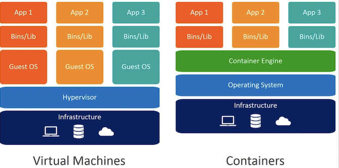
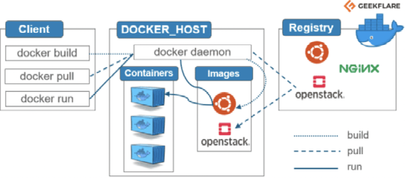

# SDS Tech-X - Conteneurisation avec docker
<br/>

## Sommaire
1. [Introduction à la virtualisation](#virtualisation)
2. [Docker](#docker)
3. [Demo d'un exemple d'appli en microservice](#demo)


<br/>

## Introduction à la virtualisation
<br>

* *__Definition__*  : Technologie permettant d'émuler plusieurs systèmes sur un même matériel physique
<br>

* *__Type de virtualisation__*  : 
    * Virtualisation d'hardware (VM)
    * Virtualisation d'OS (conteneur) <br> 
<br>

<br>

* *__Comparatif conteneur vm__*  : 
    * Temps de démarrage
    * Taille (MB vs GB)
    * Portabilité (facile vs difficile)
    * OS (partagé vs dédié)

<br>


	
<br><br>

## Docker

*** 


* *__Schéma de principe__*  : 
<br>

<br>

* *__Intérêt de Docker__*  : Faciliter et accélèrer les déploiements d’applications en construisant et exécutant des conteneurs

* *__Images__*  : Modèle et dépendance contenant les ressources nécessaires à l’exécution d’une appli. 

* *__Conteneurs__*  : Processus et ses dépendances isolés. Exécution d'une image stokée mémoire

* *__Registry__*  : Lieu d’échange et de stockage des images.


* *__Architecture de Docker__*  : Basé sur une architecture client-serveur


* *__Docker File__*  : Fichier dans lequel on renseigne des instructions qui vont permettre d’ajouter une nouvelle couche à une image afin de la personaliser.

* *__Docker Compose__*  : Fonctionnalité de Docker qui permet d’orchestrer des conteneurs entre eux. Elle permet en pratique d’établir des règles de priorités telles que ce conteneur devra s’exécuter avant tel autre .


<br>
<br>

## Quelques commandes de base

***

### Ensemble des commandes applicables à une image
```
$ Docker image
```

### Visualiser les images qu'on a dans notre Docker Desktop

```
$ Docker image ls
```


### Visualiser les containers qu'on a dans notre Docker Desktop

```
$ Docker container ls
```

### Télécharger une image

```
$ Docker pull nom_image
```

Activer l'image : en pratique construit un container

```
$ Docker run nom_image
```

### Afficher les containers éteints mais disponibles dans le Docker Desktop
```
$ Docker ps -a
```

### Supprimer un container avec ses identifiants

```
$ Docker rm "4_premiers_chiffres_identifiant_container"
```

### Supprimer une image de son Docker Desktop

```
$ Docker rmi nom_image_

```


### Supprimer les container, images, volumes et réseaux inutilisés

```
$ Docker system prune
```
<br>

## Les 2 commandes de Docker compose

***
<br> 


### Pour construire un container à partir d'une image
```
$ docker-compose build

```

### Pour instancier un conteneur en mémoire et le lancer
```
$ docker-compose up

```

***

<br>

## Liens utiles

A venir ...